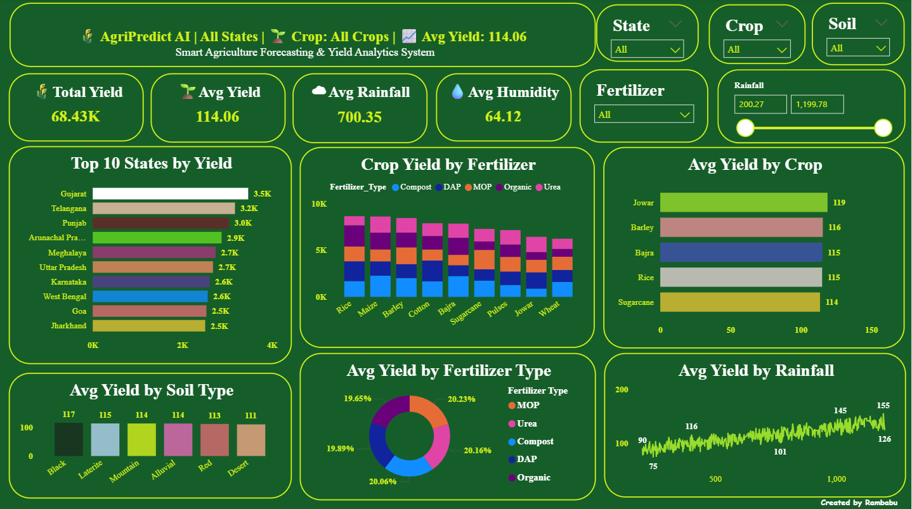
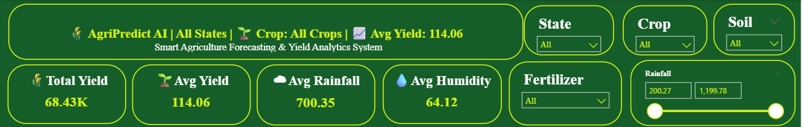
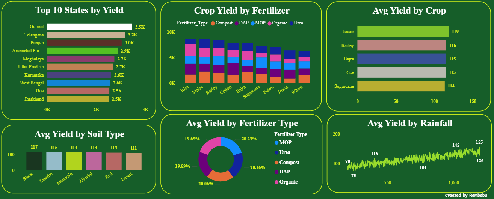
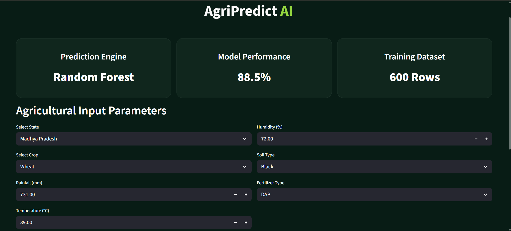
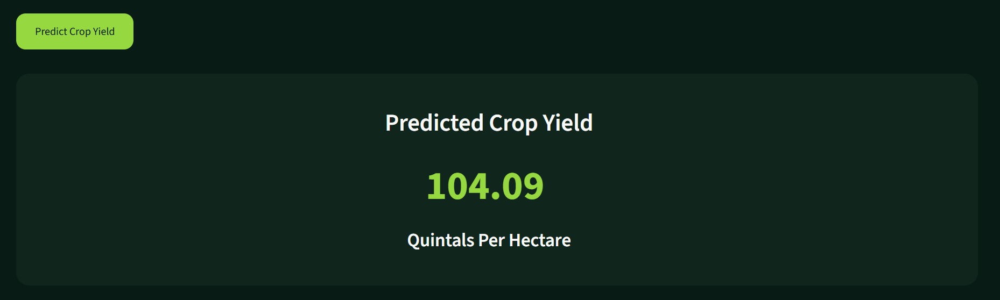

# 🌾 AgriPredict AI

AI-Powered Smart Crop Yield Prediction Platform built using Machine Learning, Python, and Streamlit.

---

# 🚀 Project Overview

AgriPredict AI is an intelligent agriculture analytics platform that predicts crop yield based on multiple environmental and agricultural parameters such as:

- State
- Crop Type
- Rainfall
- Temperature
- Humidity
- Soil Type
- Fertilizer Type

The project uses a Machine Learning model trained on agricultural datasets to generate accurate crop yield predictions.

---

# 🎯 Key Features

✅ AI-Based Crop Yield Prediction  
✅ Interactive Streamlit Dashboard  
✅ Professional Dark UI Design  
✅ Machine Learning Model Integration  
✅ Data Cleaning & Feature Engineering Pipeline  
✅ Real-Time User Input Prediction  
✅ Agriculture Analytics System  

---

# 🧠 Machine Learning Model

- Model Used: **Random Forest Regressor**
- Accuracy Achieved: **88.5%**
- Evaluation Metric:
  - R² Score
  - Mean Squared Error (MSE)

---

# 🛠️ Tech Stack

## Frontend
- Streamlit

## Backend
- Python

## Machine Learning
- Scikit-learn
- Pandas
- NumPy

## Visualization
- Power BI

---

# 📂 Project Structure

```bash
AgriPredict-AI/
│
├── app/
│   ├── main.py
│   ├── config.py
│   ├── prediction.py
│   └── utils.py
│
├── datasets/
│   ├── agriculture_dataset.csv
│   ├── agriculture_cleaned.xlsx
│   └── agriculture_features.xlsx
│
├── models/
│   ├── crop_yield_model.pkl
│   └── model_metrics.txt
│
├── python/
│   ├── data_cleaning.py
│   ├── feature_engineering.py
│   └── model_training.py
│
├── screenshots/
│
├── requirements.txt
├── .gitignore
└── README.md
```

---

# 📊 Dashboard & Screenshots

## 🔹 Main Dashboard



---

## 🔹 KPI Insights



---

## 🔹 Charts Analysis



---

## 🔹 Main UI



---

## 🔹 Prediction Result



---

# ⚙️ Installation & Setup

## 1️⃣ Clone Repository

```bash
git clone https://github.com/your-username/AgriPredict-AI.git
```

---

## 2️⃣ Open Project

```bash
cd AgriPredict-AI
```

---

## 3️⃣ Install Requirements

```bash
pip install -r requirements.txt
```

---

## 4️⃣ Run Streamlit App

```bash
streamlit run app/main.py
```

---

# 📈 Future Improvements

- Advanced Deep Learning Models
- Weather API Integration
- Live Agricultural Insights
- Farmer Recommendation System
- Deployment on Cloud
- Mobile Responsive Dashboard

---

# 👨‍💻 Author

### Rambabu Analytics

AI • Data Analytics • Machine Learning • Power BI

---

# ⭐ Support

If you liked this project, give it a ⭐ on GitHub.
